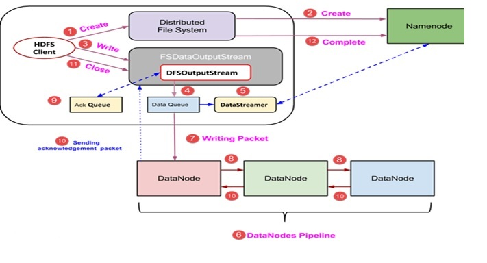

## [ HDFS Write Process ]

-------------------------HDFS Write Process-------------------------------

(1) 클라이언트는 새로운 파일을 생성하는 DistributedFileSystem 객체의 'create ()'메소드를 호출하여 쓰기 작업을 시작한다. 

(2) DistributedFileSystem 개체는 RPC 호출을 사용하여 NameNode에 연결하고 새 파일 만들기를 시작한다. 그러나 이 파일을 생성하면 작업이 파일과 어떤 블록도 연관시키지 않는다. NameNode의 책임은 생성되는 파일이 이미 존재하지 않고 클라이언트가 새 파일을 생성 할 수 있는 올바른 권한을 가지고 있는지 확인하는 것이다. 

파일이 이미 있거나 클라이언트에 새 파일을 작성할 수있는 충분한 권한이 없는  경우 IOException  이 클라이언트에 발생한다. 그렇지 않으면 작업이 성공하고 NameNode에 의해 파일에 대한 새 레코드가 만들어진다.

(3) NameNode의 새 레코드가 만들어지면 FSDataOutputStream 유형의 개체가 클라이언트에 반환된다. 클라이언트는이를 사용하여 HDFS에 데이터를 쓴다. 데이터 쓰기 메소드가 호출된다..

(4) FSDataOutputStream은 DataNodes 및 NameNode와의 통신을 살펴 보는 DFSOutputStream 개체를 포함한다. 클라이언트가 계속 데이터를 쓰는 동안  DFSOutputStream 은 이 데이터로 패킷을 계속 작성한다. 이러한 패킷은 DataQueue 라고하는 대기열에 대기열에 포함된다  .

(5) 이 DataQueue를 사용 하는  DataStreamer 라는 구성 요소가 하나 더 있다  . 또한 DataStreamer는 NameNode에 새 블록 할당을 요청하여 복제에 사용할 바람직한 DataNode를 선택한다.

(6) 이제 DataNode를 사용하여 파이프 라인을 생성하여 복제 프로세스를 시작합니다. 여기서는 복제 수준 3을 선택 했으므로 파이프 라인에 3 개의 DataNode가 있다.

(7) DataStreamer는 패킷을 파이프 라인의 첫 번째 DataNode에 집어 넣는다.

(8) 파이프 라인의 모든 DataNode는받은 패킷을 저장하고 파이프 라인의 두 번째 DataNode로 전달한다.

(9) 또 다른 큐 'Ack Queue'는 DFSOutputStream에 의해 유지되어 DataNode로부터 확인을 기다리는 패킷을 저장한다.

(10) 대기열에있는 패킷에 대한 수신 확인이 파이프 라인의 모든 DataNode로부터 수신되면 'Ack 대기열'에서 제거된다. DataNode가 실패 할 경우이 큐의 패킷을 사용하여 작업을 다시 시작한다.

(11) 클라이언트가 데이터 쓰기를 완료하면 close () 메서드 (그림 9 단계)를 호출하여 close ()를 호출하여 남아있는 데이터 패킷을 파이프 라인으로 플러시하고 승인을 기다린다.

(12) 최종 승인을 받으면 NameNode에 연락하여 파일 쓰기 작업이 완료되었음을 알린다.